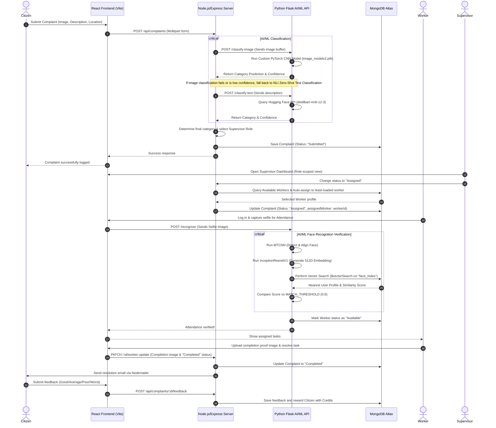

# Trinetra - Smart Governance System

**Trinetra (Smart Governance)** is a modern, AI/ML-driven civic complaint registration, routing, and resolution platform. It empowers citizens to report civic grievances (such as potholes, non-functional streetlights, sewage blockages, or trash piles) while leveraging machine learning to automate categorization, ensure worker accountability through facial recognition, and auto-route tasks to municipal staff.

---

## 🏛️ System Architecture & Workflow

The following diagram illustrates the lifecycle of a complaint—from registration by a citizen to resolution by verified municipal workers and feedback collection:



---

## 🧠 AI/ML Core Engines & Algorithms

Trinetra utilizes three distinct artificial intelligence and machine learning pipelines to streamline administration and ensure transparency.

### 1. Image Classification Engine
*   **Purpose**: Automatically identify the category of civic issue from the user's uploaded photograph.
*   **Model**: A custom deep convolutional neural network built with PyTorch.
*   **Source**: The model architecture and weights are hosted on Hugging Face at [`SoloScript/SmartGovModel`](https://huggingface.co/SoloScript/SmartGovModel).
*   **Workflow**:
    1.  On startup, the Flask backend downloads the model repository via `huggingface_hub.snapshot_download`.
    2.  It dynamically loads the architecture from `model.py` and the pre-trained weights from `image_modelv2.pth` onto CPU/GPU.
    3.  Images are pre-processed through the following transforms:
        *   **Resize**: Scaled to $224 \times 224$ pixels.
        *   **Tensor Conversion**: Cast to PyTorch float tensors.
        *   **Normalization**: Normalized using ImageNet statistics:
            $$\mu = [0.485, 0.456, 0.406], \quad \sigma = [0.229, 0.224, 0.225]$$
    4.  The output layers feed a Softmax activation to predict probabilities over 4 classes:
        *   `Drainage`
        *   `Road_Damage` (Potholes, cracks, asphalt failures)
        *   `Street_Light`
        *   `Trash` (Garbage piles, waste dumping)

### 2. Zero-Shot Text Classification (Fallback)
*   **Purpose**: Categorize complaints based on description text when images are absent or classification confidence is insufficient.
*   **Model**: `valhalla/distilbart-mnli-12-3` (hosted via Hugging Face Inference API).
*   **Algorithm**: Natural Language Inference (NLI). It treats the classification as a premise-hypothesis relation.
    *   *Premise*: "The street lamp near the park is flickering."
    *   *Hypothesis*: "This text is about street lights."
*   **Workflow**:
    *   The backend sends the description text and candidate labels `["Drainage", "Road_Damage", "Street_Light", "Trash"]` to the Hugging Face Inference API.
    *   The API calculates NLI entailment scores, which are converted to probabilities and returned to the Express backend.

### 3. Facial Recognition & Verification Engine
*   **Purpose**: Verify the identity of municipal workers on-site for secure attendance logging and task updates.
*   **Algorithms & Models**:
    *   **Face Detection**: **MTCNN** (Multi-task Cascaded Convolutional Networks) detects facial bounding boxes and landmarks, cropping and aligning the face to a standardized size ($160 \times 160$ pixels).
    *   **Embedding Generator**: **InceptionResnetV1** (pretrained on `vggface2`) maps the cropped face to a compact, highly descriptive **512-dimensional vector embedding** space.
    *   **Matching & Vector Database**: MongoDB Atlas. Rather than calculating cosine similarities manually in Python, the system offloads computations to MongoDB Atlas's native **Vector Search (`$vectorSearch`)**.
*   **Workflow**:
    1.  **Registration**: The worker registers a face image. The server computes a 512D embedding vector and saves it in the user's document under the `embedding` field.
    2.  **Recognition**: The worker uploads a selfie. The engine generates a query embedding and initiates a MongoDB Aggregation Pipeline using the `$vectorSearch` operator:
        ```json
        {
          "$vectorSearch": {
            "index": "face_index",
            "path": "embedding",
            "queryVector": [ ...512 values... ],
            "numCandidates": 100,
            "limit": 1,
            "filter": { "faceRegistered": true, "role": "worker" }
          }
        }
        ```
    3.  **Verification**: The database returns the closest match along with its `vectorSearchScore` (computed using Cosine Similarity). If the score satisfies the threshold ($> 0.6$), the worker is successfully authenticated, and their status updates to `Available`.

---

## 📁 Repository Structure

```
Trinetra-smart-governance/
├── client/                      # React SPA (Vite + JSX)
│   ├── src/
│   │   ├── components/          # Shared layout components (Navbar, Step forms)
│   │   ├── pages/               # Dashboards (Citizen, Admin, Supervisor, Worker)
│   │   └── App.jsx              # Routing and state setups
│   └── package.json
│
├── server/                      # Main Express Backend (Node.js)
│   ├── config/                  # Cloudinary, Database connections
│   ├── controller/              # Core business logic (complaints, users, workers)
│   ├── middleware/              # Auth, Scoping, Role authorizers
│   ├── models/                  # Mongoose Schemas (User.js, Complaint.js)
│   ├── routes/                  # Express Router routes
│   └── app.js                   # Server entrypoint
│
├── flask/                       # AI/ML Microservice (Flask + PyTorch)
│   ├── utils/
│   │   └── facenet_engine.py    # FaceNet / MTCNN embedder and MongoDB Vector interface
│   ├── app.py                   # Image/Text classifiers & Face recognition API endpoints
│   ├── config.py                # Database configurations & Vector search index thresholds
│   └── requirements.txt         # ML libraries (PyTorch, Torchvision, facenet-pytorch)
│
└── face-rec/                    # Standalone Face Recognition Module (Backup/Utility)
    ├── utils/facenet_engine.py  
    ├── app.py
    └── requirements.txt
```

---

## 🛠️ Installation & Setup

### Prerequisites
*   Node.js (v18+) & npm
*   Python (3.9+)
*   MongoDB Atlas Account with a cluster running

---

### Step 1: MongoDB Vector Search Index Setup
For the facial recognition search to function, you must define a Vector Search Index in your MongoDB Atlas console:
1.  Navigate to your cluster in MongoDB Atlas.
2.  Go to **Search Indexes** -> **Create Search Index** -> select **JSON Editor** under **Atlas Vector Search**.
3.  Choose the database (e.g., `trinetra`) and collection `users`.
4.  Paste the index definition below:
    ```json
    {
      "fields": [
        {
          "numDimensions": 512,
          "path": "embedding",
          "similarity": "cosine",
          "type": "vector"
        },
        {
          "path": "faceRegistered",
          "type": "filter"
        },
        {
          "path": "role",
          "type": "filter"
        }
      ]
    }
    ```
5.  Name the index `face_index` and click **Create Search Index**.

---

### Step 2: Configure Environment Variables

#### Node Backend (`/server/.env`)
Create a `.env` file inside the `server/` directory:
```env
MONGO_URI=mongodb+srv://<username>:<password>@cluster0.xxx.mongodb.net/trinetra
PORT=4000
JWT_SECRET=your_jwt_signing_key_here
FLASK_URL=http://127.0.0.1:5000

# Cloudinary (Image persistence)
CLOUDINARY_CLOUD_NAME=your_cloudinary_name
CLOUDINARY_API_KEY=your_cloudinary_key
CLOUDINARY_API_SECRET=your_cloudinary_secret

# Email setup (Nodemailer notifications)
EMAIL_ENABLED=true
EMAIL_PROVIDER=gmail
EMAIL_FROM=municipal.trinetra@gmail.com
SMTP_USER=municipal.trinetra@gmail.com
SMTP_PASS=your_app_specific_password_here
SMTP_HOST=smtp.gmail.com
SMTP_PORT=587
SMTP_SECURE=false
```

#### Flask AI Service (`/flask/.env` & `/face-rec/.env`)
Create a `.env` file in the `flask/` and `face-rec/` directories:
```env
MONGO_URI=mongodb+srv://<username>:<password>@cluster0.xxx.mongodb.net/trinetra
HF_TOKEN=your_huggingface_access_token
```

---

### Step 3: Run the Services

#### 1. Start the Flask AI Server
```bash
cd flask
# Create and activate virtual environment
python -m venv venv
venv\Scripts\activate   # Windows
source venv/bin/activate  # macOS/Linux

# Install dependencies & run
pip install -r requirements.txt
python app.py
```
*   *Flask API will run on `http://127.0.0.1:5000`*

#### 2. Start the Node.js Server
```bash
cd server
npm install
npm start   # Runs on port 4000
```

#### 3. Start the Frontend Client
```bash
cd client
npm install
npm run dev   # Runs on http://localhost:5173
```

---

## 👥 Roles & Authorization Matrices

The system implements fine-grained role-based access control (RBAC):

| Role | Permissions |
| :--- | :--- |
| **Citizen** | Submit complaints, view own complaint history, map pins, receive notifications, earn credits, submit feedback. |
| **Worker** | Perform facial verification, log attendance, view assigned complaints, submit completion proof images. |
| **Supervisor (by category)** | Scoped to specific categories (e.g., `supervisor_road`). View and update status, assign complaints to workers. |
| **Admin** | Global system view, map analytics, worker utilization overview, manage all supervisor departments. |

---

## 🏆 Key Features & Innovations
*   **Auto-routing (Least-Loaded Worker Assignment)**: High efficiency distribution of labor. When a complaint is assigned, the algorithm queries active task loads and routes it to the worker with the fewest open tickets.
*   **Real-time Geocoding**: Resolves address inputs into GPS latitude/longitude using OSM Nominatim, plotting interactive map pins for administrators.
*   **Cloud Proof storage**: Real-time upload of issue photos and completion photos to Cloudinary, ensuring complete traceability.
